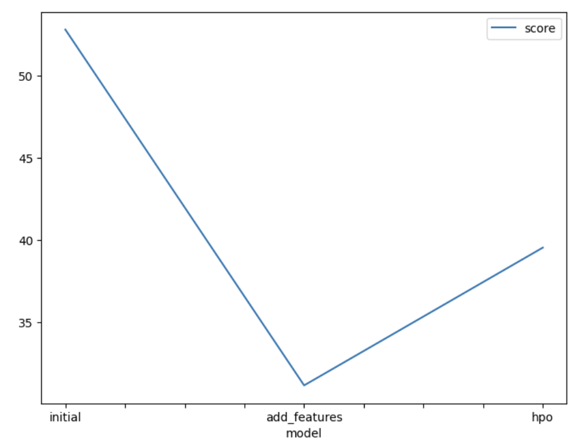
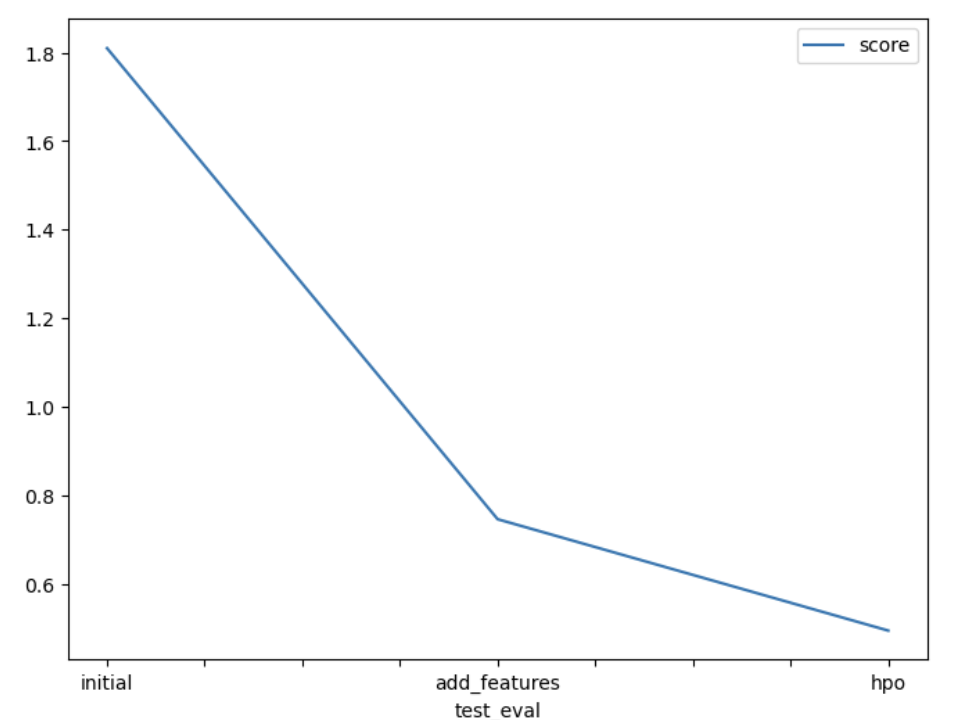

# Report: Predict Bike Sharing Demand with AutoGluon Solution
#### Olga Akukina

## Initial Training
### What did you realize when you tried to submit your predictions? What changes were needed to the output of the predictor to submit your results?
Kaggle rejects negative target values, so I had to clip the predictions at zero (e.g., pred.clip(lower=0)) before submitting. After that, the upload worked smoothly and I received both public and private scores.

### What was the top ranked model that performed?
WeightedEnsemble_L3. It blends the outputs of several base models and, thanks to the learned weights, outperformed each single model.

## Exploratory data analysis and feature creation
### What did the exploratory analysis find and how did you add additional features?
Initially, I extracted hour from datetime and cast season to categorical. That barely moved the needle.
In a second pass, I added more informative features:

- a rush-hour flag derived from hour;

- temperature bands (hot/cold),

- humidity bands (high/low),

- wind speed bands (strong/mild),
with thresholds guided by .describe()/quantiles.

### How much better did your model preform after adding additional features and why do you think that is?
The baseline Kaggle score was about 1.39641. After adding the rush-hour and weather-related features, the score improved to roughly 0.46967.
The first step (just hour + categorical season) had minimal effect; the second set of richer features made the big difference. Those features encode demand drivers (time of day and conditions), letting the model separate high- and low-demand situations more effectively.

## Hyper parameter tuning
### How much better did your model preform after trying different hyper parameters?
Trying different hyperparameters gave another lift: the Kaggle score improved to ~0.47. I tuned models like XGBoost/GBM (e.g., learning_rate, max_depth, num_boost_round, num_leaves) and used ag.space so AutoGluon could explore combinations automatically. The local validation gain was modest—suggesting slight overfitting on the selected models—but the leaderboard metric improved meaningfully.

### If you were given more time with this dataset, where do you think you would spend more time?
- Deeper EDA & features: interactions (e.g., hour × weather), work with atemp, engineered combos, alternative binning thresholds.

- Broader HPO: try more model families (KNN, neural nets, RF, CatBoost/XGBoost/LightGBM) with structured search (grids/bayesian), tuned to the competition metric.

- Robustness: stronger cross-validation, error analysis, and a light touch on temporal structure if helpful.

### Create a table with the models you ran, the hyperparameters modified, and the kaggle score.

<table border="1" class="dataframe">
  <thead>
    <tr style="text-align: right;">
      <th></th>
      <th>model</th>
      <th>hpo1</th>
      <th>hpo2</th>
      <th>hpo3</th>
      <th>score</th>
    </tr>
  </thead>
  <tbody>
    <tr>
      <th>0</th>
      <td>initial</td>
      <td>default</td>
      <td>default</td>
      <td>default</td>
      <td>1.39641</td>
    </tr>
    <tr>
      <th>1</th>
      <td>add_features</td>
      <td>default</td>
      <td>default</td>
      <td>default</td>
      <td>1.39325</td>
    </tr>
    <tr>
      <th>2</th>
      <td>hpo</td>
      <td>XGBoost(XGB): n_estimators: ag.space.Int(lower=100, upper=400, default=100), max_depth: ag.space.Int(lower=4, upper=12, default=6), learning_rate: ag.space.Real(1e-4, 1e-2, default=5e-4, log=True)</td>
      <td>CatBoost(CAT): 'iterations': 100, 'learning_rate': ag.space.Real(1e-4, 1e-2, default=5e-4, log=True), 'depth': ag.space.Int(lower=6, upper=10)</td>
      <td>Gradient Boosting Machine(GBM): 'num_boost_round': 100, 'num_leaves': ag.space.Int(lower=26, upper=66, default=36)</td>
      <td>0.46967</td>
    </tr>
  </tbody>
</table>

### Create a line plot showing the top model score for the three (or more) training runs during the project.

TODO: Replace the image below with your own.

### Create a line plot showing the top kaggle score for the three (or more) prediction submissions during the project.

TODO: Replace the image below with your own.

## Summary
The baseline run performed as expected but left a lot of accuracy on the table because it had almost no feature engineering. Once new, information-rich features were added, model quality improved substantially—even before touching the training settings. Hyperparameter tuning then delivered an extra bump by steering the learners toward better configurations.

AutoGluon made the whole process fast: it got a strong baseline in place quickly so the effort could be spent where it mattered most—designing better features and tuning a few high-impact parameters.

Key takeaways:

- Thoughtful feature engineering was the biggest driver of improvement; even simple, well-chosen features noticeably lifted the score.

- Targeted hyperparameter tuning further refined the models and produced additional gains.

- AutoGluon is a great accelerator for tabular problems, freeing time to focus on features and tuning rather than boilerplate training code.

- The combination of AutoGluon + purposeful feature design + light HPO forms a solid, repeatable workflow that generalizes to real-world tasks beyond bike-sharing demand.